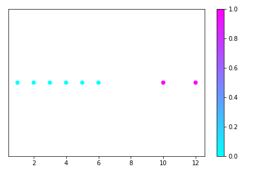

# Clustering

## What it does
This code clusters numbers.

[Cluster Analysis Link](https://en.wikipedia.org/wiki/Cluster_analysis)

## How it works
1D clustering using the biggest gap between the numbers.

- Put the numbers in numerical order.
- Find the distance between the first and second number, then the second and third number, and so on.
- Put the distances in a list.
- Find the index of the largest distance.
- Use that index to find where the group should be split.
- Make a plot using the clusters.
